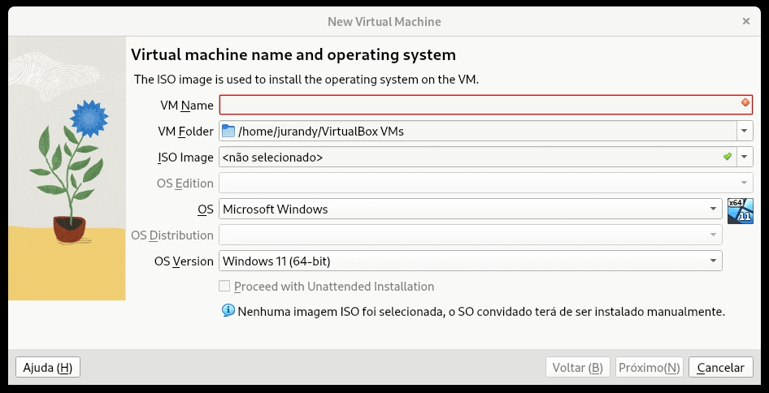
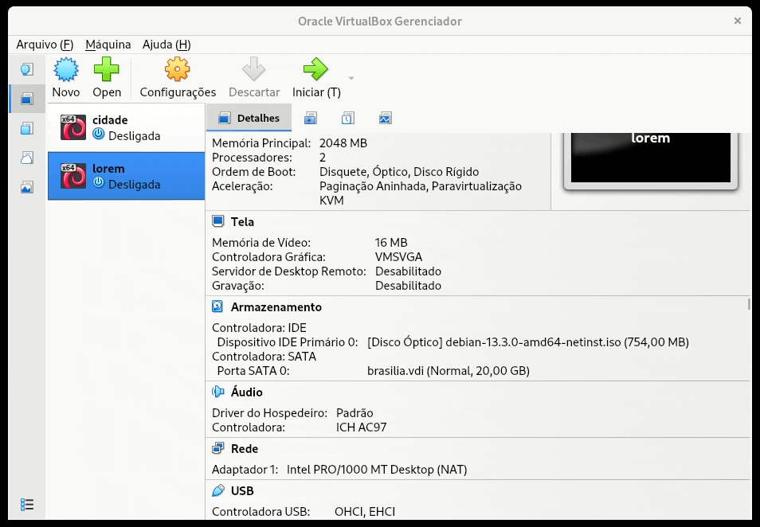
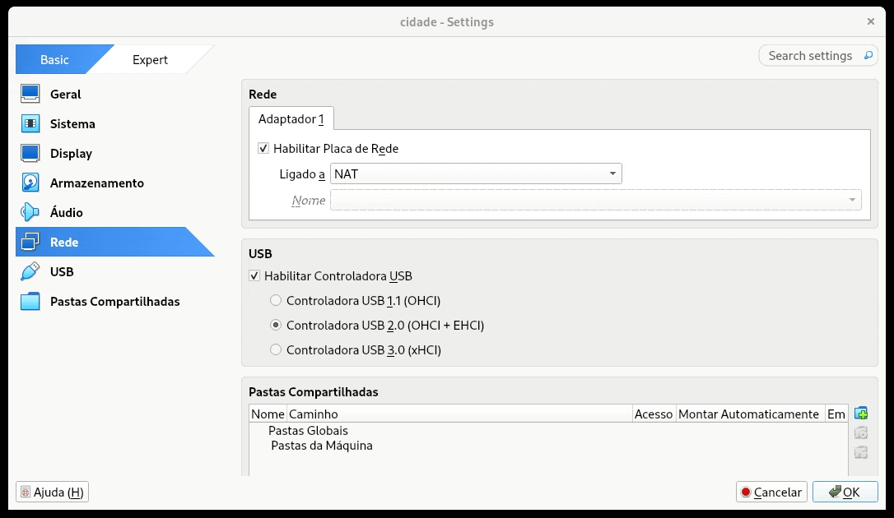

# Aula de 03/02/2026

Faça a instalação de uma distribuição GNU/Linux voltada para servidor ou contêiner em uma máquina virtual (VM) com somente um adaptador de rede e no modo Bridge. Sua VM não deverá ter interface gráfica. No entanto, a instalação poderá ser gráfica.

No VirtualBox, nomeie a VM para o slug da [cidade atribuída a você na planilha](https://docs.google.com/spreadsheets/d/11ldSPvQS64v_Uc1IfOicSieNKTrldWsxcFmJgp5UygM/edit?usp=sharing).

```{csv-table} Configurações específicas por estudante
---
encoding: utf-8
file: ./csv/capital-estudante.csv
---
```

Lista de verificação de tarefas no VirtualBox:

- [ ] Dois processadores  
- [ ] Somente um adaptador de rede habilitado  
- [ ] Adaptador de rede conectado no modo bridge  
      

Lista de configuração de tarefas no Linux:

- [ ] \[10 pontos\] Nome completo da máquina (hostname) no formato FQDN idêntico ao da planilha  
- [ ] \[10 pontos\] Servidor SSH instalado e funcionando   
      (Testar acesso remoto e transferência de arquivos)  
      Incluir arquivo de configuração do servidor  
- [ ] \[10 pontos\] Servidor HTTP instalado e funcionando  
      (Testar acesso pela URL do endereço IP fixo)  
      Incluir arquivo de configuração do servidor  
- [ ] \[10 pontos\] Dois scripts CGI, com parâmetros, executando no caminho /cgi-bin/ do servidor HTTP  
- [ ] \[10 pontos\] Interface de rede configurada com:  
      - [ ] Endereço IP fixo (o da planilha)  
      - [ ] Máscara de sub-rede /16 (na notação CIDR) ou 255.255.0.0 (na notação decimal com pontos)  
      - [ ] Endereço de gateway fixo  
      - [ ] Endereço de servidor(es) DNS fixo

## Dicas

### Criação da VM do VirtualBox




### Configuração da rede da VM



### Habilitação e configuração das interfaces de rede da VM


